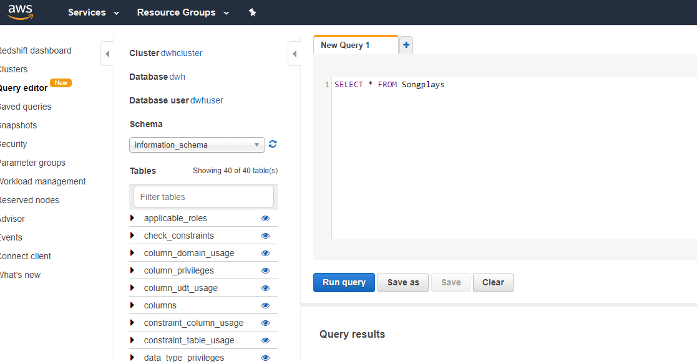

# S3 to Redshift Pipeline

Loads S3 json files into redshift staging tables, then transforms them into a star schema.

# Motivation

Experimentation and learning of AWS resources such as S3 and Redshift. This project was created as part of the Data Engineering Nano Degree, run by Udacity.

# The Project Scenario

*A music streaming startup, Sparkify, has grown their user base and song database and want to move their processes and data onto the cloud. Their data resides in S3, in a directory of JSON logs on user activity on the app, as well as a directory with JSON metadata on the songs in their app.*

*As their data engineer, you are tasked with building an ETL pipeline that extracts their data from S3, stages them in Redshift, and transforms data into a set of dimensional tables for their analytics team to continue finding insights in what songs their users are listening to.*

# Data Sets 

The pipeline process 2 types of JSON data file

## Song dataset
Each file is in JSON format and contains metadata about a song and the artist of that song. The files are partitioned by the first three letters of each song's track ID

## Log dataset
The log datasets contain activity logs from the music streaming app, and are partitioned by year and month.

# Screenshots

# Tech used

Establishing the redshift cluster with *Infrastructure as Code (IaC)*

**Built with**
- The boto3 package for AWS (Python)
- Python and SQL for ETL pipeline

# Features

- IaC means redshift can be established and taken down within the session, saving on redshift cluster costs.
- S3 COPY function + redshift utilises parallel reads on mutiple json files

# Running the process

The process is typically run in the following order:

- [create_tables.py](create_tables.py) - to reset and establish the database
- [etl.py](etl.py) - to process and load data

# More detail on script files and their purpose

[sql_queries.py](sql_queries.py)
- contains the SQL queries that are applied in both the create_tables.py file and the [etl.py](etl.py) file

[create_tables.py](create_tables.py)
- establishes the database connection, drops and recreates the database and the tables within it

[etl.py](etl.py)
- processes and loads json data into staging tables in the redshift
- transforms data from staging tables into a star schema for analysis